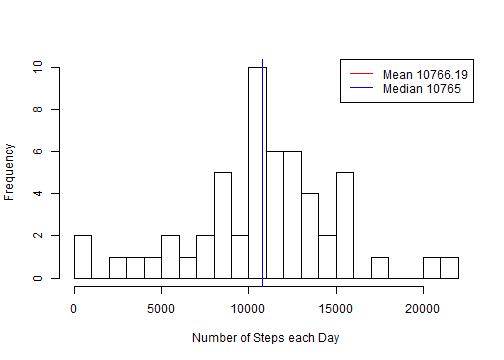
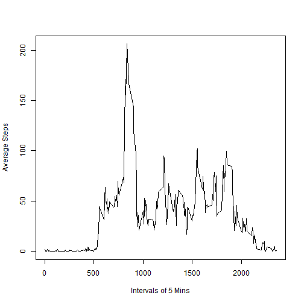
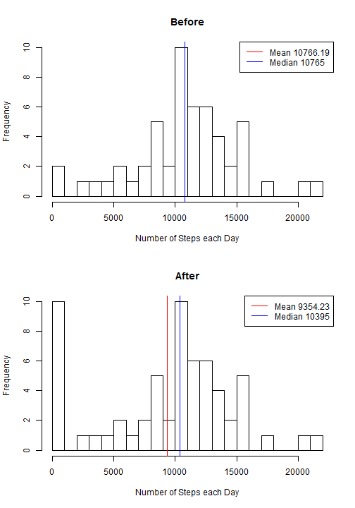
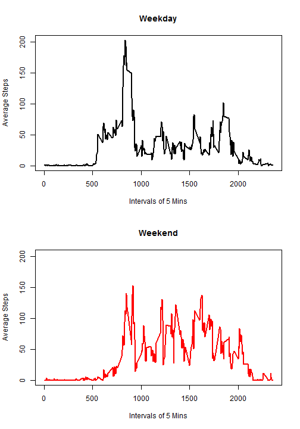

## Reproducible Research
### Peer Assessment 1

### Loading and preprocessing the data

**Here we skip the downloading and unzipping process if file already exists**


```r
library('knitr')
if(!file.exists('./activity.csv')){
    fileUrl <- 'https://d396qusza40orc.cloudfront.net/repdata%2Fdata%2Factivity.zip'
    download.file(fileUrl,destfile = "./Factivity.zip", mode = 'wb')
    unzip(zipfile = "./Factivity.zip")
}

# loading and cleaning (Removing all rows with steps == NA)
act      <- read.csv('./activity.csv')
act$date <- as.Date(as.character(act$date))
act_raw  <- act
act      <- act[complete.cases(act),]
```

### What is mean total number of steps taken per day? 

* Make a histogram of the total number of steps taken each day
* Calculate and report the mean and median total number of steps taken per day


```r
Total_Steps        <- sapply(split(act$steps,act$date),sum)
Total_Steps_mean   <- mean(Total_Steps)
Total_Steps_median <- median(Total_Steps)

hist(Total_Steps,breaks=30,xlab="Number of Steps each Day",main="")
abline(v=Total_Steps_mean,col="Red")
abline(v=Total_Steps_median,col="Blue")
legend('topright',c(paste("Mean",round(Total_Steps_mean,2)),paste("Median",round(Total_Steps_median,2))),col=c("Red","Blue"),lty=c(1,1))
```

 

### What is the average daily activity pattern?

* Make a time series plot (i.e. type = "l") of the 5-minute interval (x-axis) and the average number of steps taken, averaged across all days (y-axis)


```r
act_byInterval        <- data.frame(sapply(split(act$steps,act$interval),
                            function(x){
                                c(mean(x,na.rm = TRUE))
                            }))
names(act_byInterval) <- c("mean")
plot(act_byInterval$mean ~ as.numeric(row.names(act_byInterval)),type='l', ylab='Average Steps', xlab='Intervals of 5 Mins')
```

 

* Which 5-minute interval, on average across all the days in the dataset, contains the maximum number of steps?


```r
row.names(act_byInterval)[order(act_byInterval$mean,decreasing = TRUE)][1]
```

```
## [1] "835"
```


### Imputing missing values

* Calculate and report the total number of missing values in the dataset (i.e. the total number of rows with NAs)


```r
sum(!complete.cases(act_raw))
```

```
## [1] 2304
```

* Devise a strategy for filling in all of the missing values in the dataset. The strategy does not need to be sophisticated. For example, you could use the mean/median for that day, or the mean for that 5-minute interval, etc.
* Create a new dataset that is equal to the original dataset but with the missing data filled in.

**The strategy adopted is to fill in all missing values with the median value 0**


```r
act_raw[!complete.cases(act_raw),]$steps = 0
```

* Make a histogram of the total number of steps taken each day and Calculate and report the mean and median total number of steps taken per day. Do these values differ from the estimates from the first part of the assignment? What is the impact of imputing missing data on the estimates of the total daily number of steps?

**Yes the estimates do differ. In particular, both the median and mean are pulled down due to the injection of more data points with value 0 **


```r
par(mfrow = c(2,1))
Total_Steps        <- sapply(split(act$steps,act$date),sum)
Total_Steps_mean   <- mean(Total_Steps)
Total_Steps_median <- median(Total_Steps)

hist(Total_Steps,breaks=30,xlab="Number of Steps each Day",main="Before")
abline(v=Total_Steps_mean,col="Red")
abline(v=Total_Steps_median,col="Blue")
legend('topright',c(paste("Mean",round(Total_Steps_mean,2)),paste("Median",round(Total_Steps_median,2))),col=c("Red","Blue"),lty=c(1,1))

Total_Steps_Raw        <- sapply(split(act_raw$steps,act_raw$date),sum)
Total_Steps_Raw_mean   <- mean(Total_Steps_Raw)
Total_Steps_Raw_median <- median(Total_Steps_Raw)

hist(Total_Steps_Raw,breaks=30,xlab="Number of Steps each Day",main="After")
abline(v=Total_Steps_Raw_mean,col="Red")
abline(v=Total_Steps_Raw_median,col="Blue")
legend('topright',c(paste("Mean",round(Total_Steps_Raw_mean,2)),paste("Median",round(Total_Steps_Raw_median,2))),col=c("Red","Blue"),lty=c(1,1))
```

 

```r
par(mfrow = c(1,1))
```

### Are there differences in activity patterns between weekdays and weekends?
* Create a new factor variable in the dataset with two levels -- "weekday" and "weekend" indicating whether a given date is a weekday or weekend day. 


```r
act_raw$weekendDes <- weekdays(act_raw$date)
act_raw$weekendInd <- ifelse((weekdays(act_raw$date) == "Sunday" | weekdays(act_raw$date) == "Saturday"), "Weekend","Weekday")
act_ByWeekend      <- lapply(split(act_raw, act_raw$weekendInd),
                             function(x){
                                data <- split(x,x$interval)
                                data.frame(interval = names(data), total_steps = sapply(data,
                                     function(x){
                                            mean(x$steps)
                                        }))
                                })
par(mfrow=c(2,1))
ymin <- min(c(min(act_ByWeekend$Weekday$total_steps),min(act_ByWeekend$Weekend$total_steps)))
ymax <- max(c(max(act_ByWeekend$Weekday$total_steps),max(act_ByWeekend$Weekend$total_steps)))
plot(as.character(act_ByWeekend[[1]]$interval),act_ByWeekend[[1]]$total_steps, type="l",lwd=2, main="Weekday",ylab='Average Steps', xlab='Intervals of 5 Mins',ylim=c(ymin,ymax))
plot(as.character(act_ByWeekend[[2]]$interval),act_ByWeekend[[2]]$total_steps, type="l",lwd=2, main="Weekend",ylab='Average Steps', xlab='Intervals of 5 Mins',col="Red",ylim=c(ymin,ymax))
```

 

```r
par(mfrow=c(1,1))
```


